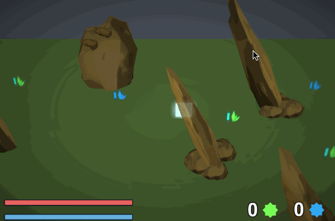
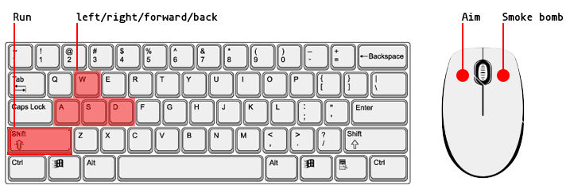

# oisio - the hunt

Oisio the hunt is a gameplay prototype. The current control design and schema makes the game mostly oriented for Pc or consoles.
You can control a character freely in a map and your goal is to __hunt__ giant monsters by hiding and attacking carefully.

The camera is close to an isometric view. You can shoot with arrows and deliver damage or critics to targets.
By farming different resources is possible to create arrows and smoke bombs.

            Aim            |          Collect          |         Play
:-------------------------:|:-------------------------:|:-------------------------:
||

##Requirements

>Unity 5.3.3_p2 or higher

##How it works

This projects tries ignore the traditional way that Unity handles components by inheriting from ```MonoBehaviour```. 
The super class ```Agent``` is the main entity which is composed by different components and states.
Components contains data and operations, they can easly reach different agent components and interact with states.

States can define relationship between components, add or remove them from the agent and process external events. There is only one active state.
They are really usefull in enemies to build their reaction pattern.


Each agent defines his own public components and states this way :
```C#
// Giant agent example
protected override List<AgentComponent> InitComponents()
{
  return new List<AgentComponent>
  {
    // insert all components here
    new AttackAnimation(),
    new AgentHealth(this),
    new MonsterAttackComponent(this)
  };
}
  
protected override AgentState[] InitStates()
{
  return new AgentState[]
  {
    // insert all states here
    new GiantIdleState(this),
    new GiantAlertState(this),
    new GiantAttackState(this),
    new GiantHuntState(this),
    new GiantRageState(this),
    new GiantBlindState(this),
    new AgentDeathState(this, DeathEffect)
    // next state
    // ...
   };
 }
```

There are many ways to manipulate components or states of an agent, here are the most used one :

__agent component operations__
```C#
agent.AddComponent( new NullComponent() );
agent.RequestComponent<AgentComponent>();
agent.RemoveComponent<AgentComponent>();
```
__change agent state__
```C#
agent.ChangeState<AgentState>();

// or by constructing an events and alert the new state
CustomEvent targetEvent = new CustomEvent(Vector3.zero, EventSubject.Attack, 0, 0f);
agent.ChangeState<AgentState>(targetEvent);
```
# Controls



# Improvements
 
1. Currently some monsters states holds and perform some very little
logic that can be moved to a component.
2. All game configurations (game data, values, controls ecc ..) should live in a .config file and loaded when the game boots.
3. Introduce additional gizmo and indicators for the player.


 
